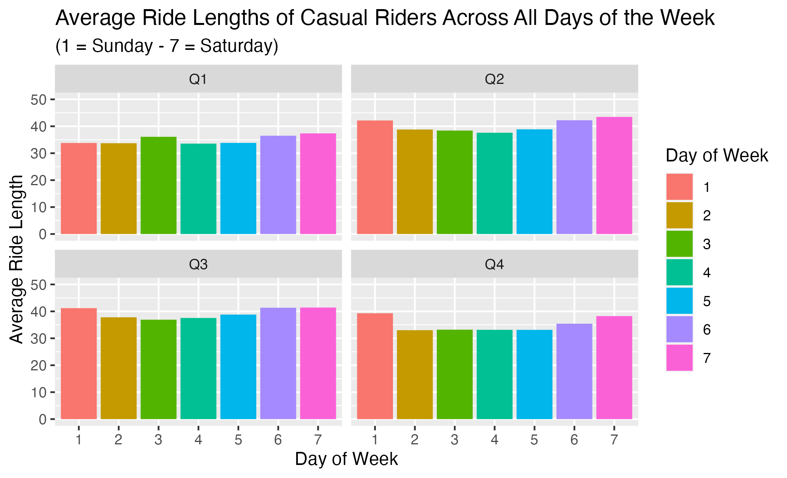
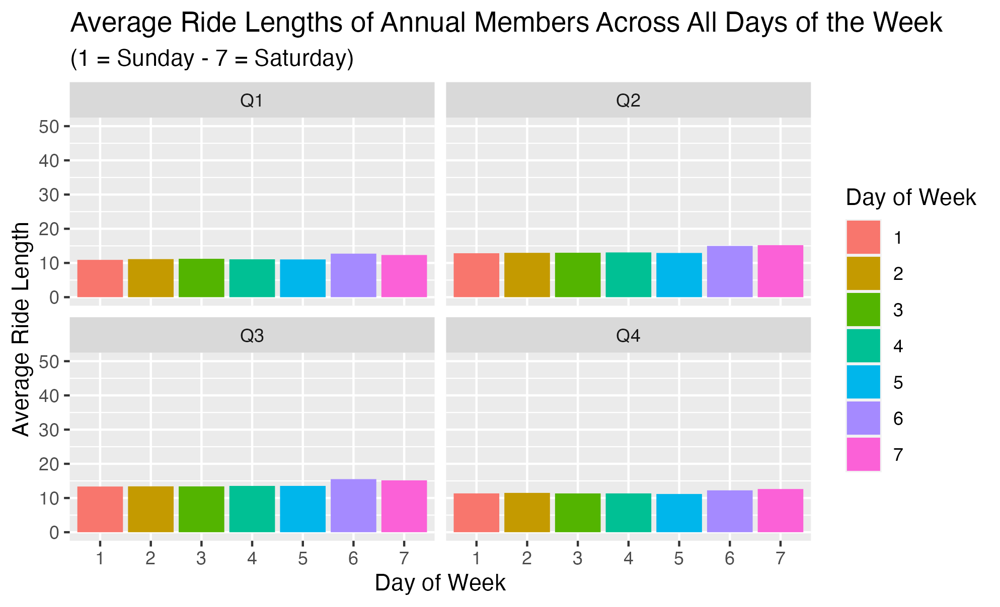
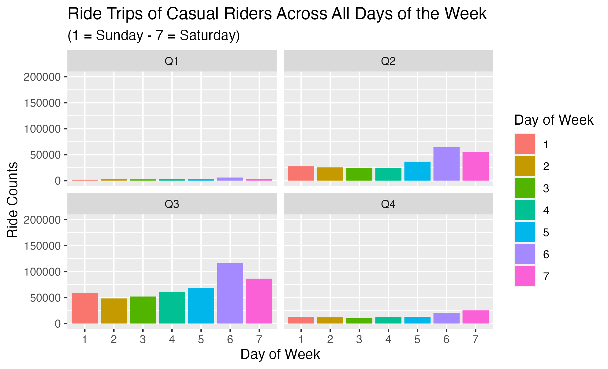
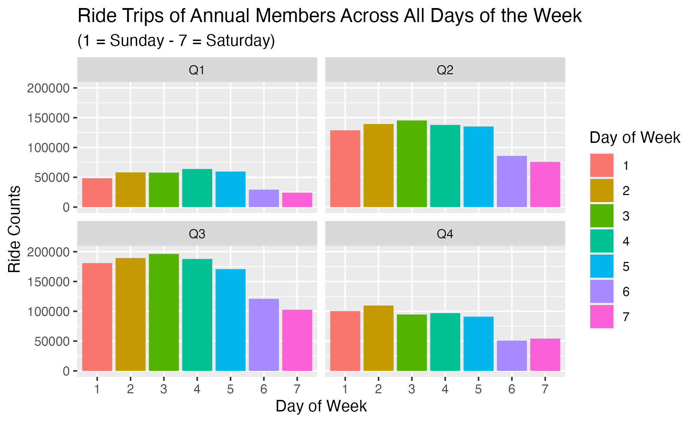

Source of the dataset: <https://divvy-tripdata.s3.amazonaws.com/index.html>

---

## Scenario

You are a junior data analyst working in the marketing analyst team at Cyclistic, a bike-share company in Chicago. The director of marketing believes the company's future success depends on maximizing the number of annual memberships. Therefore, your team wants to understand how casual riders and annual members use Cyclistic bikes differently. From these insights, your team will design a new marketing strategy to convert casual riders into annual members. But first, Cyclistic executives must approve your recommendations, so they must be backed up with compelling data insights and professional data visualizations.

## Business Task

-   How do annual members and casual riders use Cyclistic bikes differently?

## Prepare/Process Data

The data is stored on a local drive and a backup copy is created for redundancy purposes. It is grouped into four quarters and structurally organized in a csv format:

-   Q1: January to March
-   Q2: April to June
-   Q3: July to September
-   Q4: October to December

It includes Trip IDs, User type, Start and End details (IDs, names, and times) from the year 2019.

User's ride length less than 60 seconds and greater than 24 hours will be considered as outliers and will be excluded from the analysis.

Given the large sizes of the dataset, I will be using R via RStudio to Prepare, Process, and Analyze.

## Analyze

#### Loading Packages and Data

```{r load packages, message=FALSE}
library(tidyverse)
library(readr)
library(ggplot2)
```

```{r load data, message=FALSE}
divvy_q1 <- read_csv("raw_csv/Divvy_Trips_2019_Q1.csv") %>% 
  select(1, 2, 3, 6, 7, 8, 9, 10)

divvy_q2 <- read_csv("raw_csv/Divvy_Trips_2019_Q2.csv") %>% 
  select(1, 2, 3, 6, 7, 8, 9, 10)

divvy_q3 <- read_csv("raw_csv/Divvy_Trips_2019_Q3.csv") %>% 
  select(1, 2, 3, 6, 7, 8, 9, 10)

divvy_q4 <- read_csv("raw_csv/Divvy_Trips_2019_Q4.csv") %>% 
  select(1, 2, 3, 6, 7, 8, 9, 10)
```

The code above selects the following columns:

```{r columns, echo=FALSE}
colnames(divvy_q1)
```

#### Renaming Column Names

For consistency and uniqueness of the column names I will rename the columns on each quarter data.

```{r clean columns}
real_columns <- c("trip_id", "start_time", "end_time", "from_station_id", 
                  "from_station_name", "to_station_id", "to_station_name", "usertype")

colnames(divvy_q1) <- real_columns
colnames(divvy_q2) <- real_columns
colnames(divvy_q3) <- real_columns
colnames(divvy_q4) <- real_columns
```

#### Adding Columns

```{r ride length, weekday}
divvy_q1 <- add_column(divvy_q1, ride_length = divvy_q1$end_time - divvy_q1$start_time, 
                       day_of_week = wday(divvy_q1$end_time, week_start = 1))
divvy_q2 <- add_column(divvy_q2, ride_length = divvy_q2$end_time - divvy_q2$start_time,
                       day_of_week = wday(divvy_q2$end_time, week_start = 1))
divvy_q3 <- add_column(divvy_q3, ride_length = divvy_q3$end_time - divvy_q3$start_time,
                       day_of_week = wday(divvy_q3$end_time, week_start = 1))
divvy_q4 <- add_column(divvy_q4, ride_length = divvy_q4$end_time - divvy_q4$start_time,
                       day_of_week = wday(divvy_q4$end_time, week_start = 1))
```

I added the following columns:

-   `ride_length` : elapsed time of the bike ride
-   `day_of_week` : day of the week (1: Sunday - 7: Saturday)

#### Filtering Data

```{r data filtering}
divvy_q1 <- filter(divvy_q1, divvy_q1$ride_length >= 1, divvy_q1$ride_length < 1440)
divvy_q2 <- filter(divvy_q2, divvy_q2$ride_length >= 1, divvy_q2$ride_length < 1440)
divvy_q3 <- filter(divvy_q3, divvy_q3$ride_length >= 1, divvy_q3$ride_length < 1440)
divvy_q4 <- filter(divvy_q4, divvy_q4$ride_length >= 1, divvy_q4$ride_length < 1440)
```

The code above excluded the duration of the ride lower than 60 seconds and greater than 24 hours.

#### Type Conversion

```{r ride length numeric}
divvy_q1['ride_length'] <- as.numeric(unlist(divvy_q1['ride_length']))
divvy_q2['ride_length'] <- as.numeric(unlist(divvy_q2['ride_length']))
divvy_q3['ride_length'] <- as.numeric(unlist(divvy_q3['ride_length']))
divvy_q4['ride_length'] <- as.numeric(unlist(divvy_q4['ride_length']))
```

Converting `ride_length` into numeric values.

#### Replacing Values

```{r usertype replace}
replace_usertype_name <- c("Subscriber" = "Member", "Customer" = "Casual")

divvy_q1$usertype <- str_replace_all(divvy_q1$usertype, replace_usertype_name)
divvy_q2$usertype <- str_replace_all(divvy_q2$usertype, replace_usertype_name)
divvy_q3$usertype <- str_replace_all(divvy_q3$usertype, replace_usertype_name)
divvy_q4$usertype <- str_replace_all(divvy_q4$usertype, replace_usertype_name)
```

Replacing the values `Subscriber` to `Member` and `Customer` to `Casual`.

### Visualization

#### Differentiating Average Ride Lengths of Casual Riders and Annual Members

```{r}
q1_avg_rlength <- divvy_q1 %>% 
  select(usertype, ride_length) %>% 
  group_by(usertype) %>% 
  summarise(avg_ride = mean(ride_length))

q2_avg_rlength <- divvy_q2 %>% 
  select(usertype, ride_length) %>% 
  group_by(usertype) %>% 
  summarise(avg_ride = mean(ride_length))

q3_avg_rlength <- divvy_q3 %>% 
  select(usertype, ride_length) %>% 
  group_by(usertype) %>% 
  summarise(avg_ride = mean(ride_length))

q4_avg_rlength <- divvy_q4 %>% 
  select(usertype, ride_length) %>% 
  group_by(usertype) %>% 
  summarise(avg_ride = mean(ride_length))

q1_avg_rlength$quarter <- 1
q2_avg_rlength$quarter <- 2
q3_avg_rlength$quarter <- 3
q4_avg_rlength$quarter <- 4

divvy_avg_rlength <- rbind(q1_avg_rlength, q2_avg_rlength, q3_avg_rlength, q4_avg_rlength)

ggplot(divvy_avg_rlength, aes(x = quarter, y = avg_ride, col = usertype)) + 
  geom_point() + 
  geom_line() +
  labs(x = "Quarter", y = "Average Ride Lengths", col = "User Type", 
       title = "Average Ride Lengths of Casual Riders and Annual Members")
```

##### Findings

-   Casual riders, on average, ride for about 66% longer than Annual members.

---

#### Differentiating Average Ride Lengths of Users Across All Days of the Week

```{r message=FALSE, fig.keep = 'none'}
w1_avg_rlength <- divvy_q1 %>% 
  select(usertype, ride_length, day_of_week) %>% 
  group_by(usertype, day_of_week) %>% 
  summarise(avg_ride = mean(ride_length))

w2_avg_rlength <- divvy_q2 %>% 
  select(usertype, ride_length, day_of_week) %>% 
  group_by(usertype, day_of_week) %>% 
  summarise(avg_ride = mean(ride_length))

w3_avg_rlength <- divvy_q3 %>% 
  select(usertype, ride_length, day_of_week) %>% 
  group_by(usertype, day_of_week) %>% 
  summarise(avg_ride = mean(ride_length))

w4_avg_rlength <- divvy_q4 %>% 
  select(usertype, ride_length, day_of_week) %>% 
  group_by(usertype, day_of_week) %>% 
  summarise(avg_ride = mean(ride_length))

w1_avg_rlength$quarter <- "Q1"
w2_avg_rlength$quarter <- "Q2"
w3_avg_rlength$quarter <- "Q3"
w4_avg_rlength$quarter <- "Q4"

wcasual_avg_rlength <- rbind(
  w1_avg_rlength[1:7,],
  w2_avg_rlength[1:7,],
  w3_avg_rlength[1:7,],
  w4_avg_rlength[1:7,]
)

wmember_avg_rlength <- rbind(
  w1_avg_rlength[8:14,],
  w2_avg_rlength[8:14,],
  w3_avg_rlength[8:14,],
  w4_avg_rlength[8:14,]
)

wcasual_avg_rlength$day_of_week <- as.character(wcasual_avg_rlength$day_of_week)
wmember_avg_rlength$day_of_week <- as.character(wmember_avg_rlength$day_of_week)

ggplot(wcasual_avg_rlength, aes(x = day_of_week, y = avg_ride, fill = day_of_week)) + 
  geom_bar(position = "dodge", stat = "identity") + facet_wrap(~quarter) +
  scale_y_continuous(limits = c(0, 50)) +
  labs(title = "Average Ride Lengths of Casual Riders Across All Days of the Week", 
       x = "Day of Week", y = "Average Ride Length", fill = "Day of Week",
       subtitle = "(1 = Sunday - 7 = Saturday)")

ggplot(wmember_avg_rlength, aes(x = day_of_week, y = avg_ride, fill = day_of_week)) + 
  geom_bar(position = "dodge", stat = "identity") + facet_wrap(~quarter) +
  scale_y_continuous(limits = c(0, 50)) +
  labs(title = "Average Ride Lengths of Annual Members Across All Days of the Week",
       x = "Day of Week", y = "Average Ride Length", fill = "Day of Week",
       subtitle = "(1 = Sunday - 7 = Saturday)")
```

```{r echo=FALSE, fig.align="default", fig.show="hold", out.width="50%"}





```

##### Findings

-   On all days of the week, the average ride length of Casual riders is significantly longer than that of Annual members.

---

#### Differentiating Ride Trips of Users Across All Days of the Week

```{r message=FALSE, fig.keep = 'none'}
rcounts_q1 <- divvy_q1 %>% 
  count(usertype, day_of_week)

rcounts_q2 <- divvy_q2 %>% 
  count(usertype, day_of_week)

rcounts_q3 <- divvy_q3 %>% 
  count(usertype, day_of_week)

rcounts_q4 <- divvy_q4 %>% 
  count(usertype, day_of_week)

rcounts_q1$quarter <- "Q1"
rcounts_q2$quarter <- "Q2"
rcounts_q3$quarter <- "Q3"
rcounts_q4$quarter <- "Q4"

rcounts_casual <- rbind(
  rcounts_q1[1:7,],
  rcounts_q2[1:7,],
  rcounts_q3[1:7,],
  rcounts_q4[1:7,]
)

rcounts_member <- rbind(
  rcounts_q1[8:14,],
  rcounts_q2[8:14,],
  rcounts_q3[8:14,],
  rcounts_q4[8:14,]
)

colnames(rcounts_casual)[3] <- "ride_counts"
colnames(rcounts_member)[3] <- "ride_counts"

rcounts_casual$day_of_week <- as.character(rcounts_casual$day_of_week)
rcounts_member$day_of_week <- as.character(rcounts_member$day_of_week)

ggplot(rcounts_casual, aes(x = day_of_week, y = ride_counts, fill = day_of_week)) + 
  geom_bar(position = "dodge", stat = "identity") + facet_wrap(~quarter) +
  scale_y_continuous(limits = c(0, 200000)) +
  labs(title = "Ride Trips of Casual Riders Across All Days of the Week",
      x = "Day of Week", y = "Ride Counts", fill = "Day of Week",
      subtitle = "(1 = Sunday - 7 = Saturday)")

ggplot(rcounts_member, aes(x = day_of_week, y = ride_counts, fill = day_of_week)) + 
  geom_bar(position = "dodge", stat = "identity") + facet_wrap(~quarter) +
  scale_y_continuous(limits = c(0, 200000)) +
  labs(title = "Ride Trips of Annual Members Across All Days of the Week",
    x = "Day of Week", y = "Ride Counts", fill = "Day of Week",
    subtitle = "(1 = Sunday - 7 = Saturday)")
```

```{r echo=FALSE, fig.align="default", fig.show="hold", out.width="50%"}





```

##### Findings

-   On Casual rider, there were relatively few bike trips during the first and fourth quarters.
-   Throughout the entire quarter and on all days of the week, the number of bike trips taken by Annual members exceeds that of Casual riders.

---

#### Casual Riders in All Days of the Week

```{r}
divvy_2019 <- rbind(divvy_q1, divvy_q2, divvy_q3, divvy_q4)

casual_on_days <- divvy_2019 %>% filter(usertype == "Casual") %>% select(day_of_week) %>% count(day_of_week)
days_in_num <- c("1" = "Sun", "2" = "Mon", "3" = "Tue", "4" = "Wed",
          "5" = "Thu", "6" = "Fri", "7" = "Sat")
casual_on_days$day_of_week <- str_replace_all(casual_on_days$day_of_week, days_in_num)
casual_on_days$day_of_week <- factor(casual_on_days$day_of_week, levels = casual_on_days$day_of_week)

ggplot(casual_on_days, aes(x = day_of_week, y = n)) + 
  geom_bar(position = "dodge", stat = "identity", fill = "orange")+
  labs(title = "Casual Riders in All Days of the Week", x = "Months", y = "Ride Counts", subtitle = "Year 2019")
```

##### Findings

-   Casual riders rode more on Friday and Saturday.

---

#### Casual Riders in Months

```{r}
casual_on_months <- divvy_2019 %>% filter(usertype == "Casual") %>% 
  mutate(num_month = month(start_time)) %>%
  select(num_month) %>% count(num_month)
casual_on_months$num_month <- month.abb[casual_on_months$num_month]
casual_on_months$num_month <- factor(casual_on_months$num_month, levels = casual_on_months$num_month)

ggplot(casual_on_months, aes(x = num_month, y = n)) + 
  geom_bar(position = "dodge", stat = "identity", fill = "orange") +
  labs(title = "Casual Riders in Months", x = "Months", y = "Ride Counts", subtitle = "Year 2019")
```

##### Findings

-   The number of ride trips shows an upward trend from March to August and a downward trend from September to February.

---

#### Most Frequently Visited Start Station

```{r}
most_q1_sname <- divvy_q1 %>% count(from_station_name, sort = TRUE)
most_q2_sname <- divvy_q2 %>% count(from_station_name, sort = TRUE)
most_q3_sname <- divvy_q3 %>% count(from_station_name, sort = TRUE)
most_q4_sname <- divvy_q4 %>% count(from_station_name, sort = TRUE)

qs_sname <- rbind(most_q1_sname[1:3,], most_q2_sname[1:3,], most_q3_sname[1:3,], most_q4_sname[1:3,]) %>% 
  group_by(from_station_name) %>% 
  summarise(total = sum(n)) %>% 
  arrange(desc(total))

qs_sname
```

#### Most Frequently Visited End Station

```{r}
most_q1_ename <- divvy_q1 %>% count(to_station_name, sort = TRUE)
most_q2_ename <- divvy_q2 %>% count(to_station_name, sort = TRUE)
most_q3_ename <- divvy_q3 %>% count(to_station_name, sort = TRUE)
most_q4_ename <- divvy_q4 %>% count(to_station_name, sort = TRUE)

qs_ename <- rbind(most_q1_ename[1:3,], most_q2_ename[1:3,], most_q3_ename[1:3,], most_q4_ename[1:3,]) %>% 
  group_by(to_station_name) %>% 
  summarise(total = sum(n)) %>% 
  arrange(desc(total))

qs_ename
```

#### Top 6 Most Visited Station

```{r}
most_freq_stat <- unique(c(qs_sname[[1]], qs_ename[[1]]))
most_freq_stat
```

---

## Conclusion

Upon grouping the data into four quarters and filtering it to include ride lengths greater than 60 seconds and less than 24 hours, it was found that Casual riders ride, on average, about 66% longer than Annual members. Furthermore, on all days of the week, the average ride length of casual riders was found to be significantly longer than that of Annual members.

However, Casual riders took relatively few bike trips during the first and fourth quarters, whereas throughout the entire quarter and on all days of the week, the number of bike trips taken by Annual members exceeded those taken by Casual riders. In addition, it was discovered that Casual riders rode more frequently on Friday and Saturday.

Finally, an upward trend in the number of ride trips was observed from March to August, followed by a downward trend from September to February.

## Recommendations

Based on the findings, one recommendation to encourage Casual riders to become Annual members is to offer a promotional discount for Annual membership at the top 6 most visited stations during the month of August.

This can be advertised as a limited time offer and should highlight the benefits of being an Annual member, such as access to more bikes and cost savings in the long run.

Additionally, it may be helpful to target marketing efforts towards Casual riders who frequently ride on Fridays and Saturdays, and emphasize the convenience of having a membership for these weekend trips.

By offering incentives and highlighting the advantages of Annual membership, Casual riders may be more likely to switch and become more frequent and loyal users.
